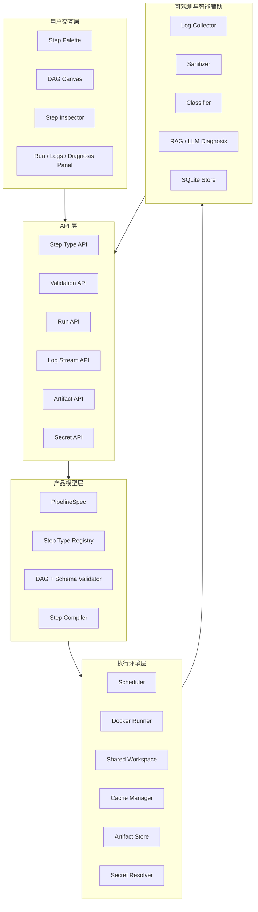
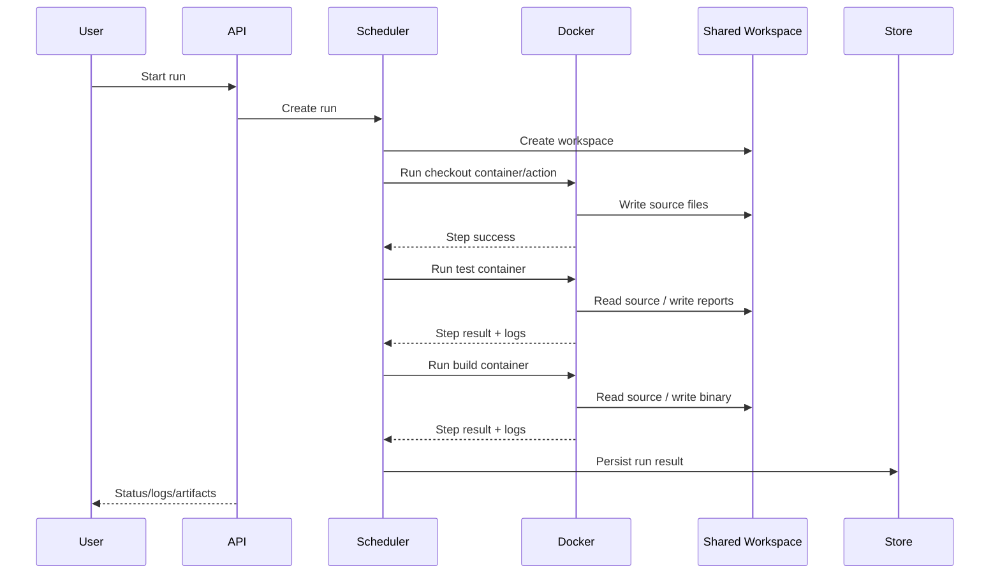

# miniflow 可视化容器流水线平台架构白皮书

> 日期: 2026-07-31
> 状态: 产品化架构白皮书

---

## 一、背景与问题

传统 CI/CD 工具通常把复杂度暴露给用户：

- 用户需要手写 YAML、Groovy 或大量 shell。
- 流水线的拓扑关系藏在文本里，不直观。
- 失败日志分散，排错需要人工翻长日志。
- 运行环境容易受到宿主机或历史任务污染。
- 构建产物、缓存、密钥和环境变量的概念分散且难理解。

miniflow 的核心机会不是再做一个庞大的 CI/CD 平台，而是把流水线产品化为一个更清晰的图形化工作台：

> 用户通过图形化方式编排 Step；miniflow 负责在 Docker 容器中可靠执行这些 Step，并提供 workspace、cache、artifact、secret、日志和诊断能力。

---

## 二、产品定位

miniflow 的定位是：

> 可视化、容器化、可扩展的流水线执行平台。

### 2.1 平台负责什么

- 基础 Step 原语。
- DAG 编排与校验。
- 临时容器执行。
- 共享 workspace。
- 缓存和产物管理。
- 密钥与环境变量注入。
- 日志采集、脱敏和分类。
- 运行历史。
- 失败诊断。

### 2.2 用户负责什么

- 业务脚本。
- 项目代码。
- 构建命令。
- 自定义 Docker 镜像。
- 部署目标。
- 团队审批流程。

### 2.3 明确不做什么

miniflow 不应该把核心能力设计成大量业务模板。内置 Step 应保持通用，如 `script.run`、`git.checkout`、`docker.build`、`http.request`。特定业务流程应留给用户脚本、镜像或后续插件。

---

## 三、核心架构



---

## 四、运行时模式

miniflow 的执行模型是：

> 每个 Step 使用一个临时 Docker 容器执行，所有容器默认挂载同一个 workspace。



### 4.1 为什么采用临时容器

- Step 之间运行时隔离，减少环境污染。
- 每个 Step 的输入输出更清晰。
- 失败定位更容易，错误通常来自镜像、命令、环境变量、secret 或 workspace 文件。
- 容器执行行为易复现。

### 4.2 为什么共享 workspace

- 前后 Step 可以通过文件自然传递产物。
- 用户心智简单：构建输出写到 workspace，下游 Step 直接读取。
- 避免早期引入复杂 artifact 依赖模型。

### 4.3 为什么还需要 artifact

共享 workspace 适合运行中传递文件，但不适合长期保存、下载、跨 run 复用和审计。因此产品化后需要 artifact：

- workspace 是运行期上下文。
- artifact 是持久化输出。
- cache 是跨 run 的依赖复用。

---

## 五、Step 类型系统

### 5.1 基本模型

```json
{
  "name": "build",
  "type": "script.run",
  "image": "golang:1.25",
  "depends_on": ["checkout"],
  "with": {
    "workdir": "/workspace",
    "shell": "sh",
    "script": "go build -o bin/miniflow ./cmd/miniflow"
  }
}
```

### 5.2 Step Registry

Step Registry 是前后端共享的事实来源：

- 前端用它渲染 Step Palette 和 Inspector。
- API 用它校验参数。
- 后端用它编译可执行 Step。
- AI 助手用它知道合法能力边界。

### 5.3 MVP Step

| Step | 说明 |
|------|------|
| `git.checkout` | 拉取代码 |
| `script.run` | 执行用户脚本 |
| `file.operation` | 文件处理 |
| `cache.restore` | 恢复缓存 |
| `cache.save` | 保存缓存 |
| `artifact.save` | 保存产物 |
| `artifact.restore` | 恢复产物 |
| `docker.build` | 构建镜像 |
| `docker.push` | 推送镜像 |
| `http.request` | 调用 webhook/API |
| `approval.manual` | 人工审批 |
| `notify.webhook` | 通知 |

这些 Step 都是平台原语，不是业务模板。

---

## 六、可视化交互

### 6.1 主界面

```text
┌──────────────┬──────────────────────────┬──────────────────┐
│ Step palette │        DAG canvas         │ Step inspector   │
│              │                          │                  │
│ Source       │  checkout → test → build  │ Basics           │
│ Script       │                  ↘ push   │ Configure        │
│ Files        │                          │ Env & secrets    │
│ Cache        │                          │ Inputs/outputs   │
│ Artifacts    │                          │ Policy           │
│ Docker       │                          │ Advanced         │
│ Integration  │                          │                  │
└──────────────┴──────────────────────────┴──────────────────┘
┌────────────────────────────────────────────────────────────┐
│ Run timeline / logs / validation problems                  │
└────────────────────────────────────────────────────────────┘
```

### 6.2 设计原则

- 图负责表达结构。
- Inspector 负责表达配置。
- Bottom Panel 负责表达运行反馈。
- Raw Spec 只作为高级视图，不作为主要输入方式。
- 用户可以通过表单配置基础 Step，也可以通过 `script.run` 完全自定义。

### 6.3 关键控件

| 内容 | 控件 |
|------|------|
| Step 名称 | input |
| 镜像 | combobox |
| 脚本 | code editor |
| 环境变量 | key/value table |
| 密钥 | picker |
| 依赖 | canvas edge |
| 缓存 key | key builder |
| 产物路径 | path/glob input |
| HTTP method | segmented control |
| 超时/重试 | number input + toggle |

---

## 七、AI 能力的位置

AI 是增强能力，不是主入口。

近期保留并强化：

- 失败日志脱敏与分类。
- RAG seed 匹配。
- LLM 结构化诊断。
- 字段级配置建议。
- 风险提示。

后置能力：

- 自然语言生成整条流水线。
- AI 自动应用修复。
- AI 生成任意脚本并执行。

原因很简单：AI 编排必须建立在稳定 Step Registry、强校验、可视化确认和运行回滚语义之上。否则会把产品复杂度和安全风险过早推高。

---

## 八、安全与隔离

### 8.1 容器隔离

- 每个 Step 使用独立容器。
- 默认非 root 用户执行。
- workspace 权限统一。
- 容器执行后清理。

### 8.2 Secret 安全

- Pipeline spec 只保存 secret 引用。
- 运行时解析 secret。
- 日志推送前脱敏。
- 前端不回显 secret 值。

### 8.3 Docker Build 风险

容器内挂载 Docker socket 很方便，但安全风险高。长期建议由 runner 后端原生调用 Docker API 执行 build/push，而不是把宿主 Docker socket 暴露给普通 Step 容器。

---

## 九、数据模型

产品化后需要新增或扩展：

| 模型 | 用途 |
|------|------|
| Pipeline | 用户保存的流水线定义 |
| Run | 一次运行实例 |
| StepRun | 单个 Step 的运行状态 |
| LogEvent | 日志流事件 |
| Artifact | 产物元数据 |
| CacheEntry | 缓存元数据 |
| Secret | 密钥引用和元数据 |
| Diagnosis | 失败诊断结果 |

SQLite 可以继续作为早期存储。接口应保持抽象，以便后续迁移 PostgreSQL。

---

## 十、阶段路线

```text
Phase A  当前可用性修正
         validate flag、Go 版本文档、示例和测试

Phase B  Step 类型系统
         type/with、Step Registry、script.run、git.checkout

Phase C  Run API
         创建 run、状态查询、取消、StepRun 状态事件

Phase D  日志流与诊断
         SSE、脱敏日志、失败诊断关联 StepRun

Phase E  Artifact / Cache / Secret
         保存、恢复、下载、命中状态、Secret API

Phase F  可视化编辑器 MVP
         Step Palette、DAG Canvas、Inspector、Run Panel

Phase G  集成 Step
         docker.build、docker.push、http.request、approval、notify
```

---

## 十一、可行性评估

### 11.1 已验证可行

- Go + Docker SDK 能支撑当前执行模型。
- 共享 workspace 与临时容器模型已经在代码中落地。
- DAG 校验、日志、SQLite、source checkout、诊断都有可用基础。
- 单元测试和构建已验证通过。

### 11.2 主要风险

| 风险 | 等级 | 应对 |
|------|------|------|
| 前端表单与后端 Step 定义不一致 | 高 | Step Registry 作为唯一事实来源 |
| artifact/workspace/cache 概念混乱 | 中 | 明确三者边界 |
| Docker build 权限过大 | 中高 | 后端原生 Docker operation |
| Secret 泄露 | 高 | spec 存引用、运行时注入、日志脱敏 |
| 过早 AI 编排 | 中 | 推迟到 Registry 和校验成熟后 |
| 分布式 Worker 过早引入 | 中 | 先单机闭环 |

### 11.3 结论

miniflow 当前已经具备产品化的执行内核。最合理的下一步不是继续堆 AI 能力，也不是先做分布式，而是建立 typed Step、Run API、实时日志、artifact/cache/secret 和可视化编辑器。这样项目会从“能跑 JSON 的 CLI 工具”变成“用户愿意使用的流水线产品”。
